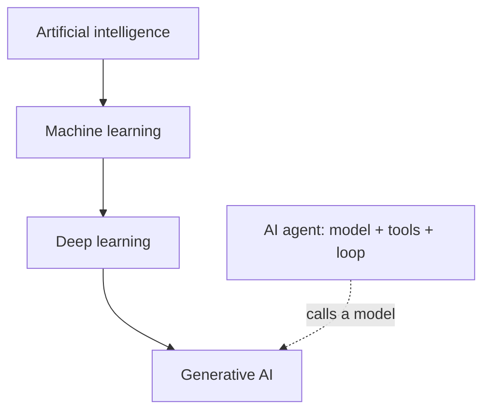
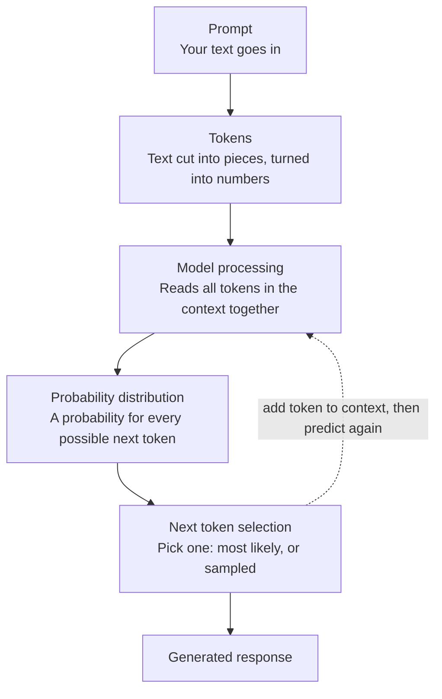

# Week 01 Questions
## Q1 - AI → ML → Deep Learning → Generative AI → Agents
### A - Answer - 
- AI is the big umbrella. It's any computer system that does things we would normally say need human thinking, like understanding language, spotting patterns, or making decisions.
- Machine learning is one way of doing AI. Instead of writing every rule by hand, you show the computer lots of data and it finds the patterns itself.
- Deep learning is a type of machine learning that uses neural networks with many layers. The deep just means lots of layers.
- Generative AI is AI that creates new things like text, images, audio or code, instead of only recognizing or predicting.
- AI agent is a whole system, not just a model. It's a model plus tools plus a loop, so it can decide what to do next, act, check the result, and keep going.
  

Examples:
- AI: Google Maps working out the fastest route home
- Machine learning:	Gmail's spam filter getting better as you mark emails as spam
- Deep learning: Your phone unlocking when it recognizes your face
- Generative AI	: Asking a chatbot to write a leave application for you
- AI agent:	A travel assistant that searches flights, checks your calendar, compares prices, and books the best one, adjusting if something fails
### E - Evidence - 
- https://www.ibm.com/think/topics/ai-vs-machine-learning-vs-deep-learning-vs-neural-networks
- https://docs.cloud.google.com/distributed-cloud/hosted/docs/latest/gdcag/application/ao-user/genai/genai-overview
- https://www.anthropic.com/engineering/building-effective-agents
### V - Verification - 
- IBM says ML is a subset of AI and DL is a subset of ML. It also says a network needs more than three layers to count as deep learning.
- Google Cloud says generative AI creates new content with characteristics similar to its training data.
- Anthropic says agents are systems where the model directs its own process and tool use.
All three matched my explanations.
### R - Reflection - 
The first four terms are easy to line up because each is a smaller part of the one before it. Agents were the odd one out because they describe how a system is built, not a kind of model.

  
## Q2 - Is Everything That Looks Intelligent Actually AI?
### A - Answer 
- Traditional software (not AI)
    - Calculator: 25 × 16 = 400 : It follows fixed arithmetic rules and gives the same answer every time. Nothing is learned.
    - If temperature > 80°C, display WARNING : A human wrote the rule and the threshold. The program only checks it.
- Machine learning based AI
    - Email system flags spam from patterns learned from past emails : It learned patterns from old email data instead of someone writing a rule for every kind of spam.
    - Navigation app predicts arrival time from traffic and historical data : It predicts a number using patterns found in historical data.
- Generative AI
    - AI assistant writes a summary of a document : It creates new text, not just a label or a number.
### E - Evidence - https://docs.cloud.google.com/distributed-cloud/hosted/docs/latest/gdcag/application/ao-user/genai/genai-overview
### V - Verification -For each scenario I asked two questions: did a human write the rule, or did the system learn it from data? And does it create new content?
- A and B have no learning step, so they're not AI.
- C and E learn from data and output a label or a number, so they're ML.
- D creates new text, so it's generative AI.
- I classified E from the description in the question. I didn't check how any real navigation app is actually built.
### R - Reflection - 
Real products often mix both. A spam filter can have hand-written rules and a learned model together, so I classified by the main behavior. Looking smart isn't enough to call something AI. The real test is whether the behavior comes from learning or from fixed rules.

## Q3 - What Happens When You Ask an LLM a Question?
### A - Answer 

- Prompt: the text you send to the model, like "What is the capital of France?"
- Tokens: the model can't read words the way we do. Your text is cut into small pieces called tokens (a word or part of a word), and each piece is turned into a number.
- Model processing: the model looks at all the tokens in its context, meaning your prompt plus anything it has already written, and works out which tokens are likely to come next.
- Probability distribution: the model gives every possible next token a probability. "Paris" might get a very high one and unrelated words get tiny ones.
- Next token selection: one token is picked, either the most likely one or one sampled from the likely ones. This is next-token prediction.
- Generated response: the chosen token is added to the context and the model predicts again. This repeats until the answer is finished, and the full text is the response.
### E - Evidence - https://developers.google.com/machine-learning/crash-course/llm
### V - Verification -I matched each stage in my diagram against both sources. Tokens, probabilities, and picking the next token all appear in them.
- The "repeat the loop" step matches the slides' description of generating text from the text generated so far.
- The point that nothing in the loop looks up facts is my own reasoning from how the loop works, not a quote from either source.

### R - Reflection - 
Sampling explains why the same prompt can give different answers on different tries. It also means a fluent answer needs checking like any other claim, which is why verification matters. One thing I'm still unsure about is how the model "reads all tokens together" in step 3. That's the attention idea, which I'll learn in a later week.

