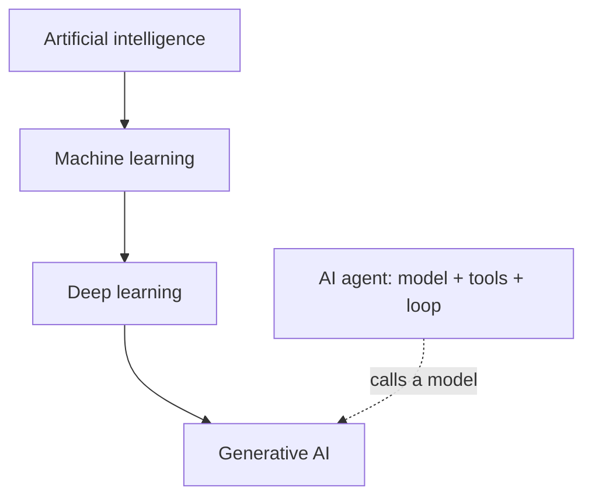
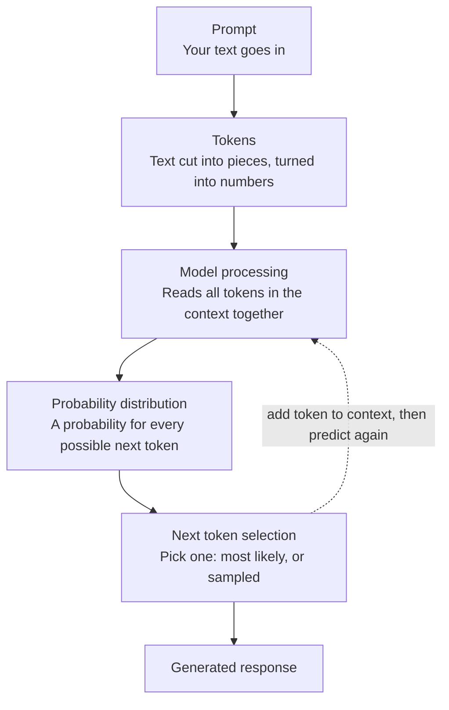
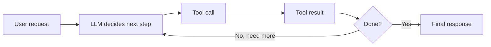

# Week 01 Questions
## Q1 - AI → ML → Deep Learning → Generative AI → Agents
### A - Answer - 
- AI is the big umbrella. It's any computer system that does things we would normally say need human thinking, like understanding language, spotting patterns, or making decisions.
- Machine learning is one way of doing AI. Instead of writing every rule by hand, you show the computer lots of data and it finds the patterns itself.
- Deep learning is a type of machine learning that uses neural networks with many layers. The deep just means lots of layers.
- Generative AI is AI that creates new things like text, images, audio or code, instead of only recognizing or predicting.
- AI agent is a whole system, not just a model. It's a model plus tools plus a loop, so it can decide what to do next, act, check the result, and keep going.
  

Examples:
- AI: Google Maps working out the fastest route home
- Machine learning:	Gmail's spam filter getting better as you mark emails as spam
- Deep learning: Your phone unlocking when it recognizes your face
- Generative AI	: Asking a chatbot to write a leave application for you
- AI agent:	A travel assistant that searches flights, checks your calendar, compares prices, and books the best one, adjusting if something fails
### E - Evidence - 
- https://www.ibm.com/think/topics/ai-vs-machine-learning-vs-deep-learning-vs-neural-networks
- https://docs.cloud.google.com/distributed-cloud/hosted/docs/latest/gdcag/application/ao-user/genai/genai-overview
- https://www.anthropic.com/engineering/building-effective-agents
### V - Verification - 
- IBM says ML is a subset of AI and DL is a subset of ML. It also says a network needs more than three layers to count as deep learning.
- Google Cloud says generative AI creates new content with characteristics similar to its training data.
- Anthropic says agents are systems where the model directs its own process and tool use.
All three matched my explanations.
### R - Reflection - 
The first four terms are easy to line up because each is a smaller part of the one before it. Agents were the odd one out because they describe how a system is built, not a kind of model.

  
## Q2 - Is Everything That Looks Intelligent Actually AI?
### A - Answer 
- Traditional software (not AI)
    - Calculator: 25 × 16 = 400 : It follows fixed arithmetic rules and gives the same answer every time. Nothing is learned.
    - If temperature > 80°C, display WARNING : A human wrote the rule and the threshold. The program only checks it.
- Machine learning based AI
    - Email system flags spam from patterns learned from past emails : It learned patterns from old email data instead of someone writing a rule for every kind of spam.
    - Navigation app predicts arrival time from traffic and historical data : It predicts a number using patterns found in historical data.
- Generative AI
    - AI assistant writes a summary of a document : It creates new text, not just a label or a number.
### E - Evidence - https://docs.cloud.google.com/distributed-cloud/hosted/docs/latest/gdcag/application/ao-user/genai/genai-overview
### V - Verification -For each scenario I asked two questions: did a human write the rule, or did the system learn it from data? And does it create new content?
- A and B have no learning step, so they're not AI.
- C and E learn from data and output a label or a number, so they're ML.
- D creates new text, so it's generative AI.
- I classified E from the description in the question. I didn't check how any real navigation app is actually built.
### R - Reflection - 
Real products often mix both. A spam filter can have hand-written rules and a learned model together, so I classified by the main behavior. Looking smart isn't enough to call something AI. The real test is whether the behavior comes from learning or from fixed rules.

## Q3 - What Happens When You Ask an LLM a Question?
### A - Answer 

- Prompt: the text you send to the model, like "What is the capital of France?"
- Tokens: the model can't read words the way we do. Your text is cut into small pieces called tokens (a word or part of a word), and each piece is turned into a number.
- Model processing: the model looks at all the tokens in its context, meaning your prompt plus anything it has already written, and works out which tokens are likely to come next.
- Probability distribution: the model gives every possible next token a probability. "Paris" might get a very high one and unrelated words get tiny ones.
- Next token selection: one token is picked, either the most likely one or one sampled from the likely ones. This is next-token prediction.
- Generated response: the chosen token is added to the context and the model predicts again. This repeats until the answer is finished, and the full text is the response.
### E - Evidence - https://developers.google.com/machine-learning/crash-course/llm
### V - Verification -I matched each stage in my diagram against both sources. Tokens, probabilities, and picking the next token all appear in them.
- The "repeat the loop" step matches the slides' description of generating text from the text generated so far.
- The point that nothing in the loop looks up facts is my own reasoning from how the loop works, not a quote from either source.

### R - Reflection - 
Sampling explains why the same prompt can give different answers on different tries. It also means a fluent answer needs checking like any other claim, which is why verification matters. One thing I'm still unsure about is how the model "reads all tokens together" in step 3. That's the attention idea, which I'll learn in a later week.

## Q4 - Hallucination Experiment: Can AI Sound Confident and Still Be Wrong?
### A - Answer 
# Hallucination Experiment: Can AI Sound Confident and Still Be Wrong?

## Experiment table

| Field | Entry |
|---|---|
| **Prompt (exact wording)** | `is sv event and verilog event same` |
| **Model A** | Claude |
| **Model A response summary** | Says SystemVerilog keeps Verilog's event model and extends it. Lists `.triggered`, `->>`, event assignment/aliasing, `null` events, extra scheduling regions, clocking blocks, and more. |
| **Model B** | ChatGPT |
| **Model B response summary** | Says the basic `event`, `->`, `@` mechanism is the same and SV adds `event.triggered()` to avoid missed events. Includes an "interview answer". |

### Claims checked

| # | Claim | Source of claim | Evidence (IEEE 1800, verify section) | Result |
|---|---|---|---|---|
| 1 | `@e` can miss an event triggered earlier; `wait(e.triggered)` avoids this because the triggered state persists for the time slot | Claude and ChatGPT | §15.5.3 (`triggered` property) | **Correct** |
| 2 | `triggered` is written as a method: `event.triggered()` | ChatGPT | `triggered` is a property accessed as `e.triggered`, with no call parentheses. ChatGPT's own code uses `done.triggered`, so it contradicts itself. | **Wrong / self-contradictory** |
| 3 | Scheduler regions are Preponed, Active, Inactive, NBA, Observed, Reactive, Re-Inactive, Re-NBA, Postponed | Claude | §4 defines more regions (Pre-Active, Pre-NBA, Post-NBA, Pre-Observed, etc.). | **Incomplete**, presented as complete |
| 4 | `-> e; @(e);` in the same process "may hang" | Claude | If the trigger comes first in the same process, the wait never sees it, so it will hang unless re-triggered. | **Imprecise** (understated) |
| 5 | Mailboxes and semaphores "build on event-style synchronization" | Claude | No supporting wording found in the LRM. | **Unsupported / loosely worded** |
| 6 | SV events can be aliased (`e1 = e2`), passed to tasks, and set to `null` | Claude | §15.5.1 and §15.5.2 | **Correct** |
| 7 | Verilog and SV share the same `event` / `->` / `@` basics | Claude and ChatGPT | §15.5 | **Correct** |

## Result

Both answers were correct on the main idea (same basic mechanism, SV adds `.triggered` for race avoidance). Each had a flaw:

- **ChatGPT:** syntax error (`triggered()`), contradicted by its own example.
- **Claude:** simplified or loosely worded details (region list, mailbox/semaphore claim, "may hang").

The test did not expose a major failure because the question was broad and the core answer is well documented. A narrower question (for example, exact region ordering or `->>` behavior) would be more likely to expose errors.

## Lesson

A correct overall answer can hide small technical errors. Both errors were stated in the same confident tone as the correct claims. In HDL work, wrong syntax or a list presented as complete can cost real debug time, so verify specific claims against the standard.

## Reflection

An AI answer can sound convincing because language models generate text that is statistically plausible, not text checked against a source. Clear structure, confident headings, tidy code examples, and even an "interview answer" make the output feel authoritative whether or not the facts are solid. Correct and incorrect details come in the same tone, so confidence in the wording says nothing about accuracy. Agreement between two agents is also weak evidence, since they may share the same training-data biases. Verification means checking the claims that matter (syntax, definitions, edge cases) against a primary source such as the IEEE 1800 LRM.

## Q5 - AI Assistant vs Search vs Authoritative Reference

### A - Answer

**Question (same for all three methods):** What does the HTTP status code 404 mean, and which standard defines it?

| | AI assistant (Claude) | Web search | Authoritative reference |
|---|---|---|---|
| What I got | 404 means "Not Found": the server couldn't find the requested page or resource. It is defined in the HTTP standard (RFC 9110). | Mostly code libraries, API docs, and blog posts listing status codes. Several restated the RFC definition. | RFC 9110, section 15.5.5, plus the IANA HTTP status code registry |
| Accuracy | Correct, but incomplete | Mostly correct, quality varied | Correct by definition |
| Explanation | Clear and short | Scattered across many pages | Precise but technical |
| Traceability | None unless you ask for sources | Sources are visible but uneven | Fully traceable |
| Ease of verification | Needs a second check | Need to judge each page | This is the check |

- What the AI missed: the RFC wording also says the server may use 404 when it is unwilling to disclose that the resource exists. My short answer left that out, so it was correct but incomplete.
- When I'd use each:
  - AI: for a quick explanation or to learn what to look up.
  - Search: to find sources and examples fast.
  - Authoritative source: before any decision where being wrong has a cost, like writing a server that returns status codes or citing a standard in a report.

### E - Evidence

- RFC 9110 on 404: the origin server did not find a current representation for the target resource, or is not willing to disclose that one exists.
- Status codes are defined by the IETF in RFC 9110 and registered with IANA.
- IANA registry: https://www.iana.org/assignments/http-status-codes/http-status-codes.xhtml
- RFC 9110: https://www.rfc-editor.org/rfc/rfc9110.html (section 15.5.5)

### V - Verification

- I found the RFC 9110 definition and the IANA registry link through search, but the search results quoted them second-hand (a Go source file, a docs page, a blog copy).
- TODO: open the RFC and IANA pages yourself and confirm the wording and the section number.
- TODO: if you used a different assistant for the AI column, replace it with its real answer.

### R - Reflection

- The AI answer was fast and mostly right, but it gave no trace to check. Search gave sources, but I had to sort the good from the weak ones. The standard answered it definitively but was the slowest to read.
- Next time I'd use AI to find the right question, search to find sources, and the primary source to settle it.

## Q6 - What Is an AI Agent?

### A - Answer

| LLM | The model itself. Text goes in, predicted text comes out. |
| LLM application | A product built around an LLM, like a chat app with a fixed prompt and an interface. |
| RAG system | An app that first retrieves relevant documents, then gives them to the LLM so its answer is based on them. |
| Tool-using assistant | An LLM that can call tools (search, calculator, calendar) but follows a mostly fixed path. |
| AI agent | An LLM that chooses its own steps, calls tools, reads the results, and loops until the goal is done. |

- Agent vs simple chatbot: a chatbot answers one message at a time. An agent works toward a goal over several steps and decides what to do next based on what the tools return.
- Non-VLSI example: a trip-planning assistant. You say "plan a 2-day trip to Mysuru under ₹8,000." It searches trains, checks hotel prices, sees the total is over budget, swaps the hotel, and rechecks before giving you the plan.

### E - Evidence

- Anthropic, [Building effective agents](https://www.anthropic.com/engineering/building-effective-agents). It separates workflows, where LLMs and tools are orchestrated through predefined code paths, from agents, where LLMs dynamically direct their own processes and tool usage.
- Google ML Crash Course, [Large language models](https://developers.google.com/machine-learning/crash-course/llm), for the LLM definition.

### V - Verification

- My agent definition matches Anthropic's workflow-vs-agent split. The tool-using assistant row is my reading of a "workflow with tools", which is a judgment call.
- "LLM application" and "RAG system" are my plain descriptions. Anthropic's guide describes the basic building block as an LLM enhanced with retrieval, tools and memory, which fits the RAG row, but I didn't find a single formal definition for each term.

### R - Reflection

- The line between a tool-using assistant and an agent is a matter of degree. The question is who decides the steps, the code or the model.
- Agents can also make a mistake at step 2 that carries through the rest of the loop, so I'd want a human check on anything consequential.

## Q7 - Where Should Humans Still Make the Decision?

### A - Answer

| Situation | Possible failure | Required verification | Who approves |
|---|---|---|---|
| Health advice, like medicine or dosage | Wrong or outdated advice causes harm | Check an official source and ask a doctor or pharmacist | A qualified professional |
| Money or legal decisions, like a contract or loan | A missed clause or made-up rule costs real money | Read the original document and check the law or the bank's terms | The person, with a lawyer or advisor for big items |
| Code or settings going into a real system | A bug or insecure change breaks something live | Run tests and review the code | A reviewer, plus passing tests |
| Summary of a document used for a decision | It leaves out or changes an important point | Compare the summary against the original | The person who will act on it |
| AI taking an action, like sending an email, paying, or deleting | An action that can't be undone, or goes to the wrong person | Preview the action before it runs | The person, before it executes |

**Rule:** AI can draft and suggest, but a human stays responsible. The harder a mistake is to undo, the more checking is needed before acting.

### E - Evidence

- The course handout says the goal is AI-assisted engineering, not handing over responsibility, and that AI output is not final authority.
- These examples and failure modes are my own reasoning, not taken from a specific source.

### V - Verification

- For each row I asked two questions: what is the worst realistic failure, and can it be undone?
- I made sure each row names something concrete to check against, not just "review it."

### R - Reflection

- A person who clicks approve without looking is not real verification. The approver needs a source, a test, or the original document in front of them.
- The more routine and low-risk a task, the easier it is to stop checking, so I should decide in advance which tasks need review.

## Q8 - Find AI Around You

### A - Answer

| System | AI involved? | Task type | Evidence / source | My conclusion |
|---|---|---|---|---|
| Gmail spam filter | Yes (ML plus rules) | Classification | Google says it uses machine learning and rules-based protections, and that TensorFlow blocks around 100 million additional spam messages a day. [9to5Google](https://9to5google.com/2019/02/06/gmail-tensorflow-spam-protections/) | ML is involved |
| Google Maps arrival time | Yes | Prediction | DeepMind says it worked with Google Maps to improve the accuracy of real-time ETAs by up to 50% in some cities, using Graph Neural Networks. [Machine Learning Times repost of the DeepMind post](https://www.predictiveanalyticsworld.com/machinelearningtimes/traffic-prediction-with-advanced-graph-neural-networks/11714/) | ML is involved |
| Netflix recommendations | Yes | Recommendation (prediction and ranking) | Netflix has said each algorithm in its recommender relies on statistical and machine learning techniques, and that it influences about 80% of hours streamed. [Quoted on bestpractice.ai](https://bestpractice.ai/ai-use-cases/case-studies/media-entertainment/netflix-reduces-customer-churn-by-several-percentage-points-using-machine-learning-to-provide-personalised-video-recommendations) | ML is involved |
| Phone Face ID | Yes | Recognition (classification) | Apple says facial matching uses neural networks trained for that purpose, with an additional network to resist spoofing. [Apple Platform Security](https://support.apple.com/guide/security/sece151358d1/web) | Neural networks (deep learning) |
| Traffic signal at a junction I use | Unknown | Control | Not enough public evidence to conclude. Some signals run on fixed timers and some adapt, and I can't tell for a specific junction. | Not enough public evidence to conclude |

**Could a simpler rule-based approach do something similar?**

- Spam: a blocklist of keywords and senders catches obvious spam, and Google still uses rules alongside ML. Rules miss new patterns like image-based spam, which is where ML helps.
- Arrival time: distance divided by average speed gives a rough estimate, but it ignores live traffic and historical patterns.

### E - Evidence

The company statements and links in the table above, plus the Netflix paper they quote from ("The Netflix Recommender System: Algorithms, Business Value, and Innovation").

### V - Verification

- For each system I looked for a statement from the company or its research team. Several of my links are news sites or reposts of the original, so open the original Google, DeepMind and Netflix pages if you can find them.
- These sources are old: Face ID 2017, Gmail 2019, DeepMind 2020, Netflix 2015. The systems may have changed since then.
- TODO: replace the traffic signal row with something you actually use if you can, and confirm you really use the other four.

### R - Reflection

- A feature sounding smart is not evidence. For the traffic signal I couldn't find proof either way, so I said so.
- The company statements are marketing-adjacent, so they show that ML is used but not exactly how.

## Q9 - Prediction, Classification, and Generation

### A - Answer

| Example | Type | Reason |
|---|---|---|
| A. Predicting house prices | Prediction | The output is a number |
| B. Image contains a cat? | Classification | It picks a label: cat or no cat |
| C. Writing an email from a short instruction | Generation | It creates new text |
| D. Will a customer cancel? | Prediction | It looks ahead at future behavior. Caveat: the yes/no output is technically classification. |
| E. Summarizing a research paper | Generation | It writes new, shorter text |
| F. Is a transaction fraudulent? | Classification | It labels the transaction as fraud or not fraud |
| G. Image from a text description | Generation | It creates a new image |
| H. Next word/token in a sentence | Prediction | It predicts what comes next. Caveat: it's also a choice among many possible tokens. |

**Why next-token prediction is fundamental:** writing, summarizing, coding and answering questions are all done by predicting one token, adding it to the text, then predicting again. The same loop produces every kind of output, so the application only looks different on the surface.

### E - Evidence

- Google ML Crash Course, [Large language models](https://developers.google.com/machine-learning/crash-course/llm)
- University of Chicago slides, [Large Language Models](https://www.classes.cs.uchicago.edu/current/25910-1/09.pdf)

### V - Verification

- I classified each example by what the output is: a number, a label, or new content.
- D and H are the borderline ones, so I wrote the caveats.
- The claim that every LLM task reduces to next-token prediction is a simplification, as models are also fine-tuned and wrapped in applications.

### R - Reflection

- Real systems mix these. A fraud system might predict a risk score and then classify it with a threshold.
- Once I saw that generation is just repeated prediction, the three types felt much closer than I first thought.

## Q10 - My Personal AI Verification Protocol

### A - Answer

| # | Step | Why it exists / what it catches |
|---|---|---|
| 1 | Define the problem and what a correct result looks like | Catches vague questions and answers that look fine but solve the wrong problem |
| 2 | Record the exact prompt and which AI tool I used | Makes the work traceable and repeatable |
| 3 | Inspect the assumptions the AI made | Catches hidden assumptions like wrong units, made-up context, or missing conditions |
| 4 | Check the key claims against a real source | Catches hallucinations and outdated facts |
| 5 | Test the result (run it, recalculate it, try an example) | Catches answers that sound right but don't actually work |
| 6 | Cross-check with a second tool or a person | Catches mistakes that only one model makes |
| 7 | Decide to accept, reject or revise, and write down why | Stops "the AI said so" from becoming a decision |

**Worked example (non-VLSI):** I ask an AI for the monthly EMI on a ₹5,00,000 loan at 10% a year for 5 years, and it says about ₹10,624.

1. Define: I want the fixed monthly payment.
2. Record: I save the prompt and the tool.
3. Assumptions: 10% is the yearly rate, the rate is fixed, and payments are monthly.
4. Check the source: I look up the standard EMI formula in a bank's documentation.
5. Test: I recompute it with the PMT function in a spreadsheet. If it gives the same figure, the AI was right.
6. Cross-check: I try a second tool or an online EMI calculator.
7. Decide: if everything matches, I accept. If the numbers differ, I find out why (for example a different rate assumption), revise, and log the difference.

### E - Evidence

- The course handout requires defining the problem, inspecting assumptions, checking evidence, testing, and deciding accept/reject/revise. Its source hierarchy puts primary sources above AI answers.
- Primary source for the example: a bank's own EMI formula page.

### V - Verification

- I checked that every required element appears in at least one step.
- I computed the example by hand with the standard EMI formula and got about ₹10,624.
- TODO: run the PMT check in a spreadsheet yourself, so the "test" step is real for you.

### R - Reflection

- Seven steps may be too many for tiny tasks, so I'd scale the effort to how costly a mistake would be.
- I expect to improve this protocol by the end of the program, especially the testing step for code and data work.
