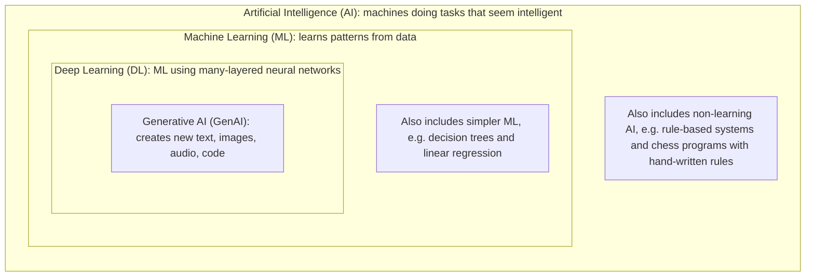

# Week 01 Questions

## Mission 1: Find AI Around You

### Systems I use in a normal day

| # | System / Feature | What I think it does | Type of task |
|---|------------------|----------------------|--------------|
| 1 | **Google Lens** | Looks at a photo or camera view and identifies objects, text, plants, landmarks or products. It can also translate text in the image and find similar items. | **Recognises** and **classifies** (images), plus **recommends** (similar products) |
| 2 | **Alexa** | Listens to my voice, turns speech into text, works out what I want (e.g. "play music", "set an alarm") and responds with speech or an action. | **Recognises** (speech), **classifies** (intent), **generates** (spoken reply) |
| 3 | **AI chatbot (e.g. Claude / ChatGPT)** | Reads my question and writes a human-like answer by predicting what text should come next. | **Generates** (text) and **predicts** (next word) |

### E - Evidence - 
### Evidence that AI/ML is involved (Google Lens)

Google Lens is built on **computer vision** and **deep learning (neural networks)**. Google's AI blog and product pages describe Lens as using machine learning to identify objects in images. It also uses OCR (optical character recognition) to read text, which is itself an ML technique.

It is also visible when using it: the same app can recognise a flower, a shoe, a landmark or a printed sentence, even from different angles, lighting and distances. Nobody could hand-write rules for every possible photo of every possible object.
### R - Reflection -All three systems use AI in different ways: Google Lens **recognises** images, Alexa **recognises speech and classifies intent**, and the chatbot **generates** text. Simple rule-based programs work for fixed, predictable inputs, but they break down when input is messy and varied, like photos, voices and natural language. That is where machine learning is useful, because it learns patterns from data instead of following rules someone wrote in advance.
 
## Mission 2: AI, ML, Deep Learning and GenAI

### Diagram

**1. Artificial Intelligence (AI)**
AI is the big idea of making computers do things that normally need human intelligence, like understanding language, recognising faces or making decisions. It does not always involve learning. Some AI just follows rules written by people.
*Example:* A chess program that uses hand-written rules to pick its next move.

**2. Machine Learning (ML)**
ML is a way of building AI where the computer is not given the rules. Instead, it is shown lots of examples and finds the patterns itself. The more good data it sees, the better it usually gets.
*Example:* A spam filter that learns from thousands of emails marked "spam" or "not spam".

**3. Deep Learning (DL)**
Deep Learning is a type of ML that uses neural networks with many layers, loosely inspired by the brain. It is very good at messy data like images, sound and language, but it needs a lot of data and computing power.
*Example:* A phone's face unlock recognising your face from the camera image.

**4. Generative AI (GenAI)**
GenAI is deep learning that creates new content instead of only labelling or predicting. It learns patterns from huge amounts of existing content and then produces new text, images, music or code that follow those patterns.
*Example:* ChatGPT or Claude writing an email, or an image generator drawing a picture from a text prompt.

### Review: asking an AI assistant to explain my diagram

The assistant said the diagram correctly shows that each term sits inside the one before it: GenAI is a kind of deep learning, which is a kind of ML, which is a kind of AI. It pointed out these things that could mislead:

| Possible misleading idea | Fix I made |
|--------------------------|------------|
| Nested boxes can suggest AI and ML are the same thing. | I added a note in the AI box that AI also includes non-learning, rule-based systems. |
| It can look like all ML is deep learning. | I added a note in the ML box that simpler methods such as decision trees and linear regression are also ML. |
| GenAI is not the only thing deep learning does. | I described deep learning as also doing recognition and prediction, not just generation. |
| Not every GenAI system is perfectly "inside" deep learning in every historical case, but today's major ones (LLMs, image generators) are. | I described GenAI as deep learning that creates new content. |

### Summary

AI is the broad goal, ML is learning from data to reach that goal, deep learning is a powerful kind of ML, and generative AI is deep learning that creates new content.

## Mission 3: Is It Really AI?

### Classification table

| # | System | Classification | Why |
|---|--------|----------------|-----|
| 1 | **Calculator** | Rule-based / traditional software | It follows fixed mathematical rules. 2 + 2 is always 4, and nothing is learned from data. |
| 2 | **Temperature warning rule** | Rule-based / traditional software | A person wrote the rule, e.g. `IF temperature > 40°C THEN show warning`. |
| 3 | **Spam filter** | ML-based AI | Modern filters learn from many emails labelled "spam" or "not spam" and spot patterns, rather than relying only on a fixed word list. |
| 4 | **Document summariser** | Generative AI | It writes new text that condenses the original, usually using a large language model. |
| 5 | **Traffic ETA prediction** | ML-based AI | It learns from past and live traffic data (speeds, time of day, accidents) to predict travel time. It predicts a number and does not create new content. |

### Explanation 1: An easy classification (Calculator)

The calculator was easy because every step is written explicitly by a programmer, and the same input always gives the same output. There is no training data, no learning and no uncertainty. It is smart-looking at maths, but it is plain traditional software.

### Explanation 2: A difficult classification (Spam filter)

The spam filter was difficult because it can be built either way. An old filter might just block emails containing words like "lottery" or "free money", which is rule-based. Modern filters like Gmail's learn patterns from huge amounts of labelled email, which is ML. I classified it as ML-based because that is how most real filters work today, but the answer depends on how a specific filter is built. I could not verify this for every filter, so the label is "mainly" ML, not "always" ML.

### Explanation 3: My own example (Fitness app step goal alerts vs. sleep score)

| Feature | Classification | Why |
|---------|----------------|-----|
| **"You reached 10,000 steps!" notification** | Rule-based | A fixed rule: `IF steps >= 10000 THEN notify`. |
| **Sleep stage detection (light, deep, REM)** | ML-based AI | It learns patterns from sensor data (heart rate, movement) labelled by sleep studies, since no simple rule can reliably separate the stages. |

The same app contains both kinds of software. This shows that "is it AI?" often applies to a **feature**, not a whole product.

### Conclusion

If the rules are written explicitly by a person, it is **not** a model learning a pattern. Rule-based software does exactly what it was told. ML learns its own rules from data, and generative AI goes further by creating new content. The practical test is: *did a person write the rule, or did the system learn it from examples?*

