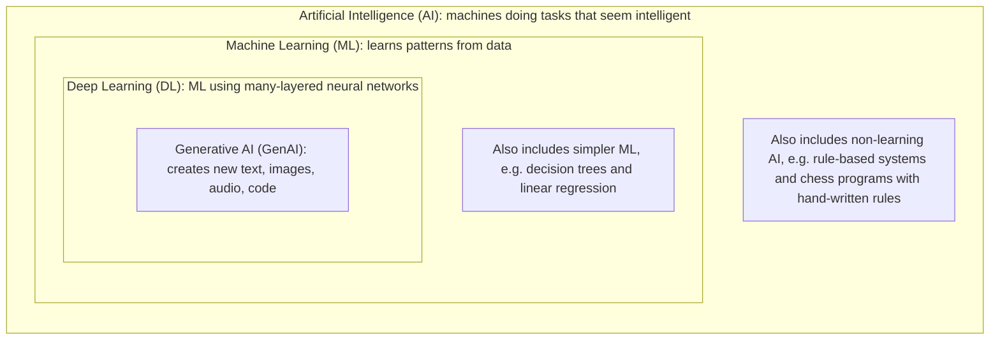
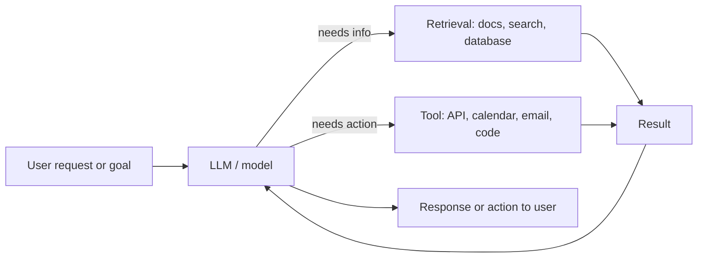
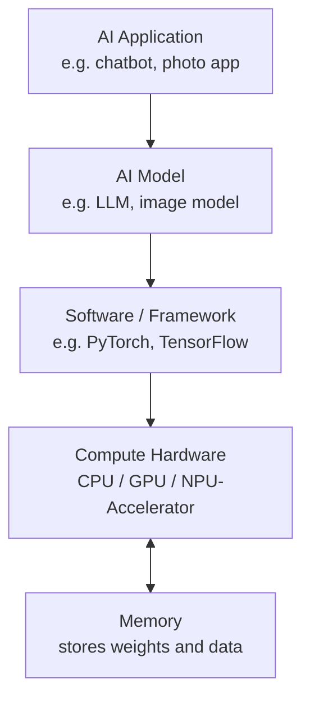

# Week 01 Questions

## Mission 1: Find AI Around You

### Systems I use in a normal day

| # | System / Feature | What I think it does | Type of task |
|---|------------------|----------------------|--------------|
| 1 | **Google Lens** | Looks at a photo or camera view and identifies objects, text, plants, landmarks or products. It can also translate text in the image and find similar items. | **Recognises** and **classifies** (images), plus **recommends** (similar products) |
| 2 | **Alexa** | Listens to my voice, turns speech into text, works out what I want (e.g. "play music", "set an alarm") and responds with speech or an action. | **Recognises** (speech), **classifies** (intent), **generates** (spoken reply) |
| 3 | **AI chatbot (e.g. Claude / ChatGPT)** | Reads my question and writes a human-like answer by predicting what text should come next. | **Generates** (text) and **predicts** (next word) |

### E - Evidence - 
### Evidence that AI/ML is involved (Google Lens)

Google Lens is built on **computer vision** and **deep learning (neural networks)**. Google's AI blog and product pages describe Lens as using machine learning to identify objects in images. It also uses OCR (optical character recognition) to read text, which is itself an ML technique.

It is also visible when using it: the same app can recognise a flower, a shoe, a landmark or a printed sentence, even from different angles, lighting and distances. Nobody could hand-write rules for every possible photo of every possible object.
### R - Reflection -All three systems use AI in different ways: Google Lens **recognises** images, Alexa **recognises speech and classifies intent**, and the chatbot **generates** text. Simple rule-based programs work for fixed, predictable inputs, but they break down when input is messy and varied, like photos, voices and natural language. That is where machine learning is useful, because it learns patterns from data instead of following rules someone wrote in advance.
 
## Mission 2: AI, ML, Deep Learning and GenAI

### Diagram



**1. Artificial Intelligence (AI)**
AI is the big idea of making computers do things that normally need human intelligence, like understanding language, recognising faces or making decisions. It does not always involve learning. Some AI just follows rules written by people.
*Example:* A chess program that uses hand-written rules to pick its next move.

**2. Machine Learning (ML)**
ML is a way of building AI where the computer is not given the rules. Instead, it is shown lots of examples and finds the patterns itself. The more good data it sees, the better it usually gets.
*Example:* A spam filter that learns from thousands of emails marked "spam" or "not spam".

**3. Deep Learning (DL)**
Deep Learning is a type of ML that uses neural networks with many layers, loosely inspired by the brain. It is very good at messy data like images, sound and language, but it needs a lot of data and computing power.
*Example:* A phone's face unlock recognising your face from the camera image.

**4. Generative AI (GenAI)**
GenAI is deep learning that creates new content instead of only labelling or predicting. It learns patterns from huge amounts of existing content and then produces new text, images, music or code that follow those patterns.
*Example:* ChatGPT or Claude writing an email, or an image generator drawing a picture from a text prompt.

### Review: asking an AI assistant to explain my diagram

The assistant said the diagram correctly shows that each term sits inside the one before it: GenAI is a kind of deep learning, which is a kind of ML, which is a kind of AI. It pointed out these things that could mislead:

| Possible misleading idea | Fix I made |
|--------------------------|------------|
| Nested boxes can suggest AI and ML are the same thing. | I added a note in the AI box that AI also includes non-learning, rule-based systems. |
| It can look like all ML is deep learning. | I added a note in the ML box that simpler methods such as decision trees and linear regression are also ML. |
| GenAI is not the only thing deep learning does. | I described deep learning as also doing recognition and prediction, not just generation. |
| Not every GenAI system is perfectly "inside" deep learning in every historical case, but today's major ones (LLMs, image generators) are. | I described GenAI as deep learning that creates new content. |

### Summary

AI is the broad goal, ML is learning from data to reach that goal, deep learning is a powerful kind of ML, and generative AI is deep learning that creates new content.

## Mission 3: Is It Really AI?

### Classification table

| # | System | Classification | Why |
|---|--------|----------------|-----|
| 1 | **Calculator** | Rule-based / traditional software | It follows fixed mathematical rules. 2 + 2 is always 4, and nothing is learned from data. |
| 2 | **Temperature warning rule** | Rule-based / traditional software | A person wrote the rule, e.g. `IF temperature > 40°C THEN show warning`. |
| 3 | **Spam filter** | ML-based AI | Modern filters learn from many emails labelled "spam" or "not spam" and spot patterns, rather than relying only on a fixed word list. |
| 4 | **Document summariser** | Generative AI | It writes new text that condenses the original, usually using a large language model. |
| 5 | **Traffic ETA prediction** | ML-based AI | It learns from past and live traffic data (speeds, time of day, accidents) to predict travel time. It predicts a number and does not create new content. |

### Explanation 1: An easy classification (Calculator)

The calculator was easy because every step is written explicitly by a programmer, and the same input always gives the same output. There is no training data, no learning and no uncertainty. It is smart-looking at maths, but it is plain traditional software.

### Explanation 2: A difficult classification (Spam filter)

The spam filter was difficult because it can be built either way. An old filter might just block emails containing words like "lottery" or "free money", which is rule-based. Modern filters like Gmail's learn patterns from huge amounts of labelled email, which is ML. I classified it as ML-based because that is how most real filters work today, but the answer depends on how a specific filter is built. I could not verify this for every filter, so the label is "mainly" ML, not "always" ML.

### Explanation 3: My own example (Fitness app step goal alerts vs. sleep score)

| Feature | Classification | Why |
|---------|----------------|-----|
| **"You reached 10,000 steps!" notification** | Rule-based | A fixed rule: `IF steps >= 10000 THEN notify`. |
| **Sleep stage detection (light, deep, REM)** | ML-based AI | It learns patterns from sensor data (heart rate, movement) labelled by sleep studies, since no simple rule can reliably separate the stages. |

The same app contains both kinds of software. This shows that "is it AI?" often applies to a **feature**, not a whole product.

### Conclusion

If the rules are written explicitly by a person, it is **not** a model learning a pattern. Rule-based software does exactly what it was told. ML learns its own rules from data, and generative AI goes further by creating new content. The practical test is: *did a person write the rule, or did the system learn it from examples?*

# Mission 4: Make AI Explain Itself, Then Test It

## AI Prompts Used
1. "Explain how an LLM produces an answer to my prompt."
2. "Now explain it to me as a beginner using a simple example."

## Final Explanation

An LLM first splits your prompt into small pieces called **tokens** and converts each one into numbers. A neural network called a **transformer** then processes those numbers. Its **attention** mechanism lets each token weigh which other tokens matter for its meaning. The model outputs a probability for every possible next token, **samples** one (usually with some randomness), and appends it to the text. It repeats this loop one token at a time until the answer is complete. It learned these patterns by training on huge amounts of text, practicing next-token prediction.

## One Correction / Clarification

The AI's one-sentence summary said the model predicts "the **most likely next word**." This needed correcting in two ways:

1. **It predicts tokens, not always words.** Tokens can be word fragments, punctuation, or spaces.
2. **It doesn't always pick the most likely option.** It usually *samples* from the probability distribution, which is why the same prompt can give different answers. Only greedy selection (temperature 0) always picks the top token.

Also, the percentages in the AI's "cat sat on the ___" example were invented for illustration. Real models don't display numbers like that by default.

## Source Links
- https://en.wikipedia.org/wiki/Attention_Is_All_You_Need
- https://arpitbhayani.me/blogs/how-llms-work
- https://blog.miguelgrinberg.com/post/how-llms-work-explained-without-math/page/2

# Mission 5: Can AI Be Confidently Wrong?

## Prompt
"Why do we use m and p sequencers in UVM "

## AI Answer
> Both point to the same sequencer, the one your sequence runs on.
>
> - `m_sequencer` is the generic handle UVM gives you automatically. It only knows the basic sequencer type, so you can use it to `start()` other sequences, but you can't see your own custom fields.
> - `p_sequencer` is the same handle with your own sequencer's type. You create it with `` `uvm_declare_p_sequencer(MY_SEQR) ``, and it lets you reach custom things like `p_sequencer.a_sqr`.
>
> Use `m_sequencer` for simple cases, and `p_sequencer` when your sequence needs something inside your sequencer, like in a virtual sequence.

## Verification Source
https://www.vlsijobseekers.com/uvm/m_seq_and_p_seq.html
https://verificationguide.com/uvm/m_sequencer-and-p_sequencer/
## Result
**Mostly correct but incomplete, with two unsupported details in the earlier longer answer.**
The short answer was accurate. The longer answer stated two things confidently that the source does not support: where the cast happens (`pre_body()`) and what the `m_`/`p_` letters stand for. Both were said in the same confident tone as the correct parts.

## Lesson
Confidence in the wording is not evidence of correctness. The correct and the unsupported claims sounded equally sure. Verify specific mechanism details (which function does what, what a name stands for) against source code or official docs, because those are the details an AI is most likely to fill in from plausible-sounding guesses.


# Mission 6: Chatbot or Agent?

## Definitions (simple)

- **LLM:** An LLM (Large Language Model) is a type of artificial intelligence program trained on massive amounts of text data to understand, summarize, translate, and generate human-like language.
- **AI application:** An AI application is a software program or system that uses artificial intelligence techniques—such as machine learning, natural language processing (NLP), and computer vision—to perform tasks that normally require human-like intelligence, reasoning, learning, and decision-making
- **RAG (Retrieval-Augmented Generation):** : An AI framework that improves large language models (LLMs) by connecting them to external knowledge bases or databases. Instead of relying only on its static training data, the model retrieves relevant documents first and uses them to ground its response
- **Tool-using assistant:** An LLM that can request a tool call (search, calculator, calendar, code runner). Software runs the tool and returns the result to the model, which then replies. Usually one request, one or a few tool calls.
- **Agent:** An LLM-driven system given a goal that decides its own steps in a loop: plan, use tools, check results, adjust, and repeat until the goal is done or it needs help. It can take actions in the world.

## Flow Diagram



The loop from **Result back to Model** is what separates a simple chatbot from a tool-using system. An agent repeats this loop many times, deciding the next step each round, until the goal is met.

## Comparison Table

| | LLM | AI application | RAG | Tool-using assistant | Agent |
|---|---|---|---|---|---|
| What it is | Base model | Product around a model | Model + document retrieval | Model + callable tools | Model + tools + a goal-driven loop |
| Gets outside information? | No | Maybe | Yes (retrieval) | Yes (tools) | Yes |
| Takes actions? | No | Maybe | No | Yes, when asked | Yes, on its own steps |
| Who decides the steps? | Nobody (single reply) | Developer's fixed flow | Fixed: retrieve, then answer | Model picks a tool, human drives | Model plans and decides |
| Number of steps | 1 | Varies | 2 (search, answer) | 1 to a few | Many, until the goal is done |
| Example | Raw model API | Support chat website | "Ask my company policy PDF" bot | Chatbot that checks live weather | Assistant that books a whole trip |
| Main risk | Wrong or outdated answers | Bad design | Retrieving wrong or irrelevant text | Wrong tool or wrong input | Compounding errors, unwanted actions |

## Everyday Example of an Agentic Workflow

**Goal: "Plan and book a dinner for me and two friends on Friday."**

1. The agent checks my calendar for free time (tool).
2. It checks the friends' availability or sends them a poll (tool).
3. It searches for restaurants nearby that match our tastes and budget (retrieval).
4. It checks which have a table for 3 on Friday (tool).
5. If none are available, it changes the time or the restaurant and tries again (loop).
6. It books the table, adds it to the calendar, and messages everyone (actions).
7. It asks me to confirm before spending money or sending anything final (human check).

A chatbot would only *suggest* restaurants. The agent pursues the goal across steps and acts.

# Mission 7: What Actually Runs AI?

## 1. What is a CPU and what is it good at?

A **CPU (Central Processing Unit)** is the general-purpose "brain" of a computer. It has a small number of powerful cores that run a wide variety of tasks quickly, one after another, including decisions, branching logic, and managing the operating system.

**Good at:** running the OS, general programs, complex logic with many decisions, and coordinating other hardware. It is flexible but handles only a few things at a time.

## 2. What is a GPU and why is it useful for AI?

A **GPU (Graphics Processing Unit)** has hundreds to thousands of simpler cores that do the same kind of operation on lots of data at once. It was built for graphics, where millions of pixels need similar math at the same time.

AI models are mostly huge amounts of **matrix multiplication** (multiplying and adding large grids of numbers). That work splits naturally into many independent pieces, so a GPU finishes it far faster than a CPU.

## 3. What is an NPU / AI accelerator, and why specialised hardware?

An **NPU (Neural Processing Unit)** or **AI accelerator** (for example Google's TPU) is a chip designed specifically for neural network math, mainly matrix multiplication and related operations.

Because it does one job, it can do it with **more speed and less power** than a general CPU or GPU. Systems use specialised hardware because AI workloads are large and repetitive, and energy and cost matter. This is especially true on phones and laptops (battery) and in data centres (electricity bills).

## 4. What does parallel computation mean?

Doing **many calculations at the same time** instead of one after another.

> Example: adding 1,000 pairs of numbers. A CPU works through them a few at a time. A GPU assigns thousands of cores to add many pairs simultaneously.

It only helps when the calculations are independent of each other, which is true for most of the math inside neural networks.

## 5. Why does AI depend so heavily on compute and memory?

- **Compute:** a model performs billions or trillions of multiply-add operations to process a single input.
- **Memory:** a model has millions to billions of **parameters** (weights) that must be stored and fetched during computation. Input data and intermediate results also take space.
- Often the chip waits for data to arrive from memory instead of computing, so **memory capacity and memory speed** limit performance as much as raw compute does.

## 6. Training vs. inference (hardware view)

| | Training | Inference |
|---|---|---|
| What happens | The model learns by adjusting its weights over huge amounts of data | A trained model produces an output for a new input |
| Computation | Forward pass, plus working out how to adjust weights, repeated many times | Mainly the forward pass only |
| Compute needed | Very large | Smaller per request, but happens many times |
| Memory needed | Very high (weights plus extra data used for learning) | Lower, mostly weights and the current input |
| Typical hardware | Clusters of many GPUs/TPUs in data centres | GPUs, NPUs, or CPUs, in the cloud or on a device |
| Priority | Total throughput over days or weeks | Low latency (fast reply) and low power/cost |

## 7. Diagram



Text version:

```
AI Application  ->  AI Model  ->  Software/Framework  ->  CPU / GPU / Accelerator  <->  Memory
```

The arrow between hardware and memory goes both ways because the chip constantly reads weights and data and writes results back.

## 8. Real AI workload example

**Workload: running a chatbot (LLM inference) for many users.**

**Best hardware: GPUs or dedicated AI accelerators** in a data centre.
- Generating each token requires large matrix multiplications, which run well in parallel.
- Large model weights need lots of fast memory, which AI GPUs/accelerators provide.
- A CPU still helps by handling the web server, request routing, and other general tasks.


# Mission 8: Where Could AI Help in My VLSI Track?

**Track chosen:** Design Verification (DV)

| Item | Answer |
|---|---|
| **Task** | Debugging failing simulation regressions (reading logs and waveforms to find why UVM tests fail) |
| **Why it fits AI** | It involves repetition, search, and data analysis: engineers read through thousands of log lines, group similar failures, and look for patterns across many test runs. |
| **How AI might help** | AI can summarise long simulation logs, cluster failures that share the same error message, and suggest likely causes (for example, a scoreboard mismatch or a missing objection), so I can reach the root cause faster. |
| **Why human/domain knowledge still matters** | AI can guess wrongly with confidence, so I still need to understand the design spec, UVM behaviour, and waveforms to decide whether the failure is a real RTL bug, a testbench bug, or a bad test, and to verify any fix. |

# Mission 9: My AI Working Agreement

## My 5 Rules

1. **Verify before I trust.**
   I will check important facts, code, and technical claims against a reliable source (official docs, specs, library source code, or a simulation) before using them. Confident wording is not evidence of correctness.

2. **Never share confidential or proprietary information.**
   I will not paste company code, RTL, testbenches, design specs, tool scripts, or anything under NDA into a public AI tool. If I need help, I will remove or generalise sensitive details first, or use only approved tools.

3. **Use AI to learn, not to skip learning.**
   I will try the problem myself first, then use AI to explain, review, or suggest alternatives. I should be able to explain any answer I submit in my own words without the AI.

4. **Ask for reasoning and sources, and test the answer.**
   I will ask AI to explain why, and I will run or test what it gives me (compile the code, simulate the sequence, check the waveform). If it can't be tested, I'll treat it as an unverified guess.

5. **I own my final work.**
   If I submit it, I am responsible for it, including any mistakes AI introduced. I will note where AI helped and never blame the tool for an error I failed to check.
